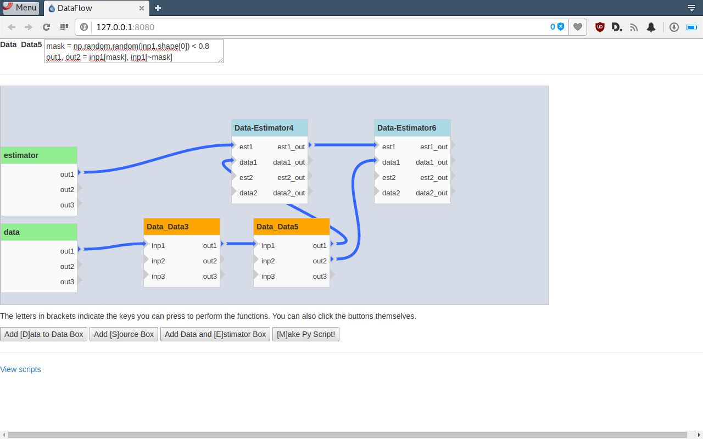

DataFlow
========

Tries to expose sk-learn via a dataflow diagram

Documentation
-------------

- There are three main types of blocks
    - **Source blocks** create something out of nothing. These are the blocks which read datasets and create estimators
    - **D2D** Data to data blocks transform data in some way.
    - **DE** Data and Estimator blocks take in a dataset and an estimator and return a transformed dataset and estimator. These are typically training blocks.
- All blocks can be connected in a data flow diagram. 
- Controls:

To use dataflow, run `python dataflow.py` and navigate to `127.0.0.1:8080` in your browser. The data blocks can be added and connected by hand.

Once the command is issued to make a file, it is generated in `static/scripts/`

