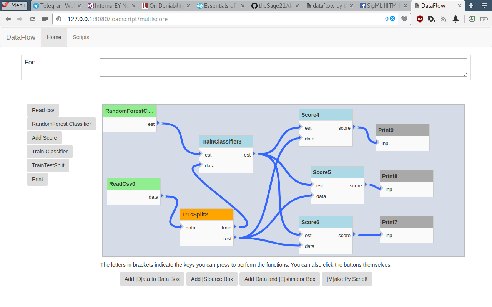

DataFlow
========

I used to love working on [Blender's](https://www.blender.org) node editor in
my college days. That love was invoked again once I encountered Microsoft's
MLStudio. I liked it for the simple fact that I did not have to type a lot.
That is where dataflow originates from.

Dataflow provides nodes/boxes/operators which represent processing units. These
are connected via links/data paths/lines to show dependency. There are four
main kinds of boxes (Source, Sink, DataData, DataEstimator). These are named so
because Dataflow tries to expose as much of the sk-learn api as possible via a
dataflow diagram.

In the future dataflow may not remain limited to Python.


Get Started
-----------

Here's a session from start to finish.

```bash
virtualenv -p python3 env
source env/bin/activate
git clone https://github.com/theSage21/dataflow dataflow
cd dataflow
pip install -r requirements.txt
dataflow
```


This should start a bottle server at `0.0.0.0:8080`. When you navigate to that address via the browser, you see a simple page.

1. There is a textbox at the top. This shows code associated with blocks/boxes. It is editable.
2. There is a workspace right in the middle of the screen. This is where all the diagrams go.
3. There are buttons on the left. Clicking one adds a box to the workspace. They all get added on the top left corner.
4. You can move the boxes around. To connect inputs to outputs click on an output and then on another input.
5. Once your diagram is done, click on the `make py` button at the bottom.
6. It will ask you for a name to give to your diagram.
7. You can now navigate to the `/scripts` url and see all the scripts.


In case you don't like what is on offer, you can add a custom button using the
buttons given at the bottom. The letters included inside `[ ]` act as hotkeys
to add those types of boxes.


Trivia
-------------

- There are three main types of blocks
    - **Source blocks** create something out of nothing. These are the blocks which read datasets and create estimators
    - **D2D** Data to data blocks transform data in some way.
    - **DE** Data and Estimator blocks take in a dataset and an estimator and return a transformed dataset and estimator. These are typically training blocks.
    - **Sink** Data sinks are things like `print` blocks which create no outputs.
- All blocks can be connected in a data flow diagram. 
- Controls:


To use dataflow, run `dataflow` and navigate to `127.0.0.1:8080` in your browser. The data blocks can be added and connected by hand.

Once the command is issued to make a file, it is generated in `static/scripts/`



## This flowchart generates the following code

```python
# Generated on
# 2017-01-31 17:31:48.506545
# via DataFlow: https://github.com/theSage21/dataflow


import numpy as np
import pandas as pd
from sklearn.metrics import roc_auc_score, accuracy_score, f1_score
from sklearn.ensemble import RandomForestClassifier
from sklearn.model_selection import cross_val_score, train_test_split

#########################################################


def ReadCsv0():
    data = pd.read_csv("data.csv")
    return data
    

def RandomForestClassifier1():
    est = RandomForestClassifier(n_jobs=-1)
    return est
    

def TrTsSplit2(data=None):
    X, Y = data.drop("target", axis=1), data.target
    x_tr, x_ts, y_tr, y_ts = train_test_split(X, Y, 0.25)
    train = x_tr["target"] = y_tr
    test = x_ts["target"] = y_ts
    return train, test
    

def TrainClassifier3(est=None, data=None):
    X, Y = data.drop("target", axis=1), data.target
    est.fit(X, Y)
    return est
    

def Score4(est=None, data=None):
    X, Y = data.drop("target", axis=1), data.target
    p = est.predict(X)
    score = roc_auc_score(Y, p)
    return score
    

def Print7(inp=None):
    print(inp)
    return 
    

def Print8(inp=None):
    print(inp)
    return 
    

def Print9(inp=None):
    print(inp)
    return 
    

def Score5(est=None, data=None):
    X, Y = data.drop("target", axis=1), data.target
    p = est.predict(X)
    score = accuracy_score(Y, p)
    return score
    

def Score6(est=None, data=None):
    X, Y = data.drop("target", axis=1), data.target
    p = est.predict(X)
    score = f1_score(Y, p)
    return score
    

#########################
#MAIN
#########################
# Parts within steps can be run in parallel


# Step --------------------------<[1]>-

var1 = RandomForestClassifier1()
var0 = ReadCsv0()

# Step --------------------------<[2]>-

var2, var3 = TrTsSplit2(var0)

# Step --------------------------<[3]>-

var4 = TrainClassifier3(var1, var2)

# Step --------------------------<[4]>-

var7 = Score6(var4, var3)
var6 = Score5(var4, var3)
var5 = Score4(var4, var3)

# Step --------------------------<[5]>-

Print9(var5)
Print8(var6)
Print7(var7)
```
